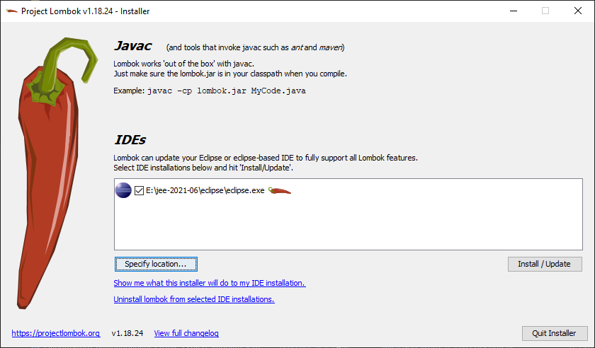
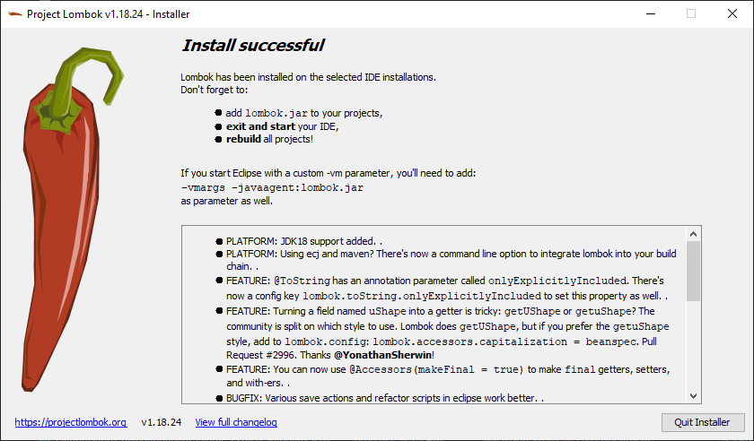
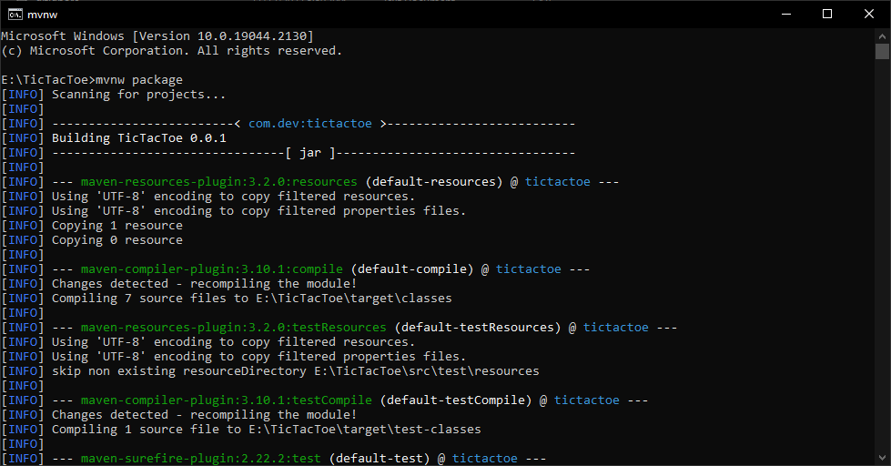
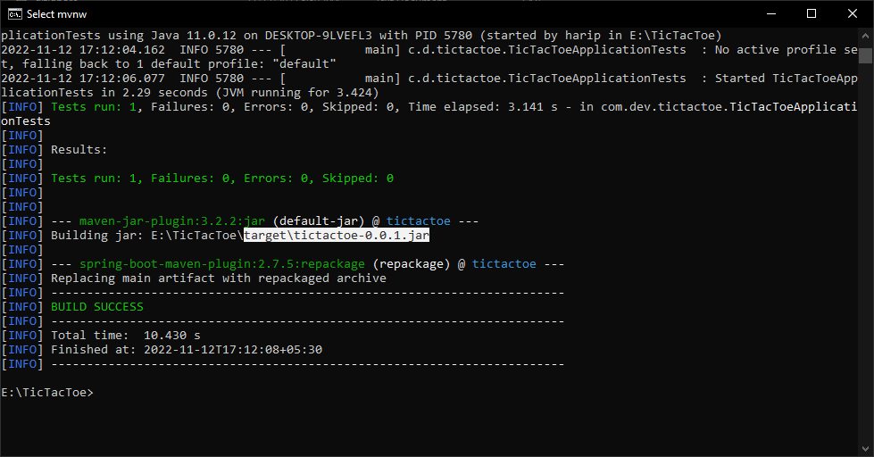
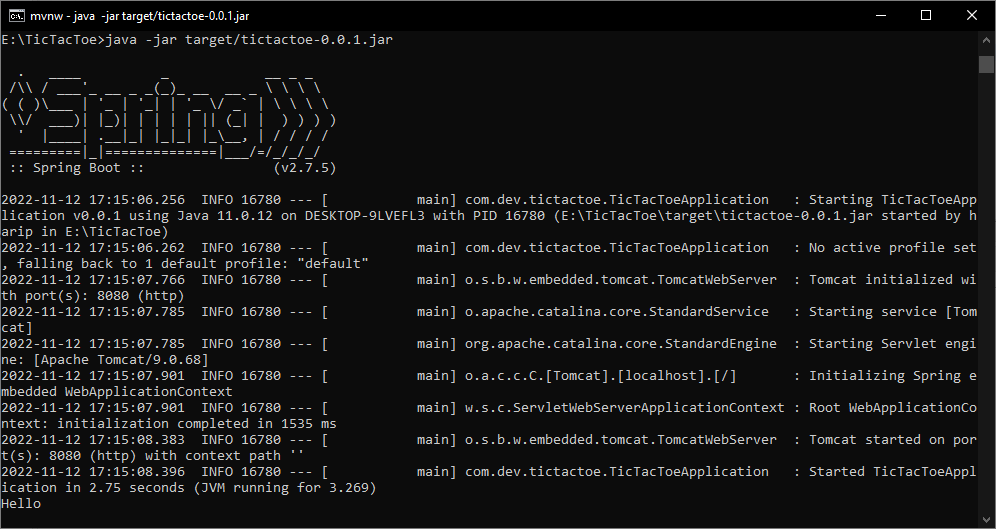

# Tic Tac Toe

### Pre-conditions

* System should be available with Java version 11 and Maven
* System should be installed with lombok jar

    * 

    * 

* Set Environmental Variables
    * JAVA_HOME = C:\Program Files\Java\jdk-11.0.12
    * M2_HOME = C:\apache-maven-3.8.2
    * PATH = %M2_HOME%\bin;%JAVA_HOME%\bin
* Navigate to project path contains mvnw.cmd

### Run the below command in project path to create jar

```
mvnw package

```






### Run the below command to start the application server
```
java -jar target/tictacktoe-0.0.1.jar

```



### Tic Tac Toe Player

* X
* O

### Tic Tac Toe Position


### Tic Tac Toe Test cases covered

* X always goes first.

### Tic Tac Toe Application Endpoint Details
```
Method: POST
URI: http://localhost:8080/tic-tac-toe
Required Input: RequestBody
Sample RequestBody Input: 
[
    {
        "position": "A1",
        "player": "O"
    }
]

Sample Output: 
{
    "message": "X always goes first",
    "status": "FAIL"
}

```
